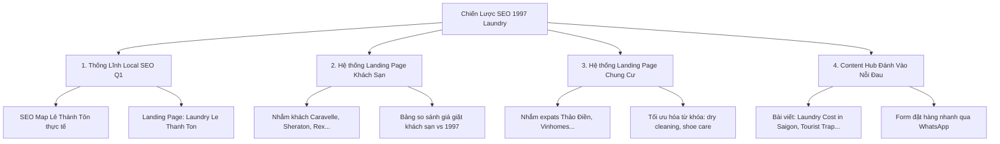

# Chiến Lược SEO Bứt Phá Cho 1997 Laundry (1997laundry.com) Để Đánh Bại Giặt Ơi! (giatoi.vn)

Chào bạn, xin lỗi vì sự nhầm lẫn ở bước trước khi tôi tưởng bạn là chủ sở hữu của `giatoi.vn`. Bây giờ mục tiêu đã rõ ràng: **Chúng ta cần tối ưu hóa và phát triển website 1997laundry.com để đánh bại Giặt Ơi! trên toàn bộ các từ khóa tiếng Anh** tại khu vực Quận 1 và các vùng lân cận.

---

## I. Phân Tích Đối Thủ & Điểm Yếu Của Họ

**Giặt Ơi! (giatoi.vn)** hiện đang dẫn đầu nhiều từ khóa tiếng Anh nhờ chiến lược **Programmatic SEO** cực kỳ thông minh:
*   Họ tạo ra hàng trăm trang đích ảo nhắm vào từng khách sạn cụ thể (Caravelle, Sheraton...), từng tuyến đường (Lê Thánh Tôn, Bùi Viện...) và từng chung cư (Masteri Thảo Điền, Vinhomes...).
*   Họ có nội dung giải quyết đúng "nỗi sợ" của khách du lịch (sợ hỏng đồ hiệu, sợ bẫy chặt chém ở Bùi Viện, sợ giá giặt của khách sạn quá đắt).

**Điểm yếu của Giặt Ơi!:**
*   Họ không có cửa hàng vật lý tại mọi địa điểm họ phủ trang web (ví dụ: họ phủ trang Lê Thánh Tôn, Thảo Điền nhưng thực chất họ chỉ có một vài địa điểm cố định).
*   Các bài viết của họ mang tính chất "sản xuất hàng loạt", nhiều trang có nội dung trùng lặp (boilerplate text) chỉ thay thế tên địa danh. Google sẽ dần hạ bệ các trang này trong các bản cập nhật cốt lõi (Core Updates) nếu có một đối thủ làm nội dung **thực tế** và **chất lượng** hơn.

---

## II. Chiến Lược "Đánh Bại" Giặt Ơi! Cho 1997 Laundry

Để chiến thắng, 1997laundry.com cần triển khai chiến lược **"Chiếm lĩnh địa bàn thực tế + Nhân bản hệ thống trang đích chất lượng cao"**.

---

### Trụ cột 1: Thống Lĩnh Local SEO Phố Lê Thánh Tôn (Lợi Thế Sân Nhà)
1997 Laundry có cửa hàng vật lý thực tế tại **15B/63 Lê Thánh Tôn, Quận 1** (khu phố Nhật sầm uất). Đây là vũ khí mạnh nhất mà đối thủ ảo không có.

*   **Tối ưu Google Business Profile (Maps):**
    *   Tên Maps: `1997 Laundry - Best Same-Day Laundry & Dry Cleaning Saigon` (Chứa từ khóa chính: *Same-Day Laundry*, *Dry Cleaning*).
    *   Cập nhật đầy đủ ảnh chụp thực tế bên ngoài cửa hàng (có bảng hiệu 1997) và quy trình giặt bên trong.
    *   Đăng bài (Google Update) thường xuyên bằng tiếng Anh và tiếng Nhật giới thiệu dịch vụ lấy nhanh.
*   **Tạo trang đích "Lê Thánh Tôn":**
    *   Tạo trang: `1997laundry.com/laundry-service-le-thanh-ton/`
    *   Nội dung: Nhấn mạnh bạn là cửa hàng thật nằm ngay hẻm 15B/63 Lê Thánh Tôn. Khách lưu trú tại các serviced apartments trên đường này có thể mang đồ qua trực tiếp (chỉ 2 phút đi bộ) hoặc nhân viên qua lấy miễn phí.

---

### Trụ cột 2: Tạo Hệ Thống Landing Page Khách Sạn (Hotel-Targeted Pages)
Khách du lịch ở các khách sạn lớn quanh Quận 1 (cách bạn dưới 1.5km) luôn tìm kiếm: *"laundry near Sheraton Saigon"*, *"laundry near Caravelle hotel"*, *"laundry near Lotte Hotel Saigon"*. Họ sợ giá giặt của khách sạn (thường cực kỳ đắt đỏ).

*   **Hành động:** Tạo các trang đích con cho từng khách sạn:
    *   `1997laundry.com/laundry-near-caravelle-hotel-saigon/`
    *   `1997laundry.com/laundry-near-sheraton-saigon/`
    *   `1997laundry.com/laundry-near-rex-hotel-saigon/`
    *   `1997laundry.com/laundry-near-park-hyatt-saigon/`
*   **Cấu trúc nội dung trang khách sạn để thắng đối thủ:**
    *   **Tiêu đề:** *"Save up to 80% on Laundry near Caravelle Hotel Saigon"* (Tiêu đề cực kỳ thu hút du khách).
    *   **Nội dung:** Làm bảng so sánh giá giặt khách sạn (ví dụ: $5 - $10/món) vs. giá của 1997 Laundry (khoảng $1 - $2/món).
    *   **Cam kết:** Giao nhận tận sảnh (lobby) khách sạn miễn phí, hoàn thành trong 2h-4h (express) hoặc trong ngày.
    *   **CTA:** Nút ghim WhatsApp gửi tin nhắn trực tiếp để nhân viên qua sảnh lấy đồ ngay.

---

### Trụ cột 3: Hệ Thống Landing Page Chung Cư & Khu Expats (Apartment Pages)
Khách nước ngoài (Expats) sống tại các khu vực cao cấp như Thảo Điền, An Phú hay Vinhomes thường tìm dịch vụ giặt hấp (Dry cleaning) và vệ sinh giày hiệu lâu dài.

*   **Hành động:** Tạo các trang đích con:
    *   `1997laundry.com/laundry-service-thao-dien/`
    *   `1997laundry.com/laundry-service-masteri-thao-dien/`
    *   `1997laundry.com/laundry-service-vinhomes-central-park/`
*   **Nội dung:** Tập trung vào các từ khóa chất lượng cao như: *Premium Dry Cleaning*, *Sneaker & Shoe Care*, *Bedding & duvet laundry*.

---

### Trụ cột 4: Xây Dựng Content Hub Đánh Vào Nỗi Đau Của Khách Du Lịch
Giặt Ơi đang làm rất tốt việc kéo traffic thông tin bằng cách giải quyết nỗi đau của du khách. Bạn cần làm nội dung chất lượng hơn họ.

*   **Các bài viết Blog cần xuất bản ngay (Bằng tiếng Anh & Tiếng Nhật):**
    1.  *“How much does laundry cost in Vietnam? (2026 Price Guide)”* - Đánh vào từ khóa so sánh giá.
    2.  *“Laundry in Bui Vien: Avoid common tourist traps & scams”* - Hướng dẫn du khách tránh các tiệm giặt cân điêu, làm mất đồ hoặc giặt chung nước bẩn ở khu phố Tây.
    3.  *“Hotel Laundry vs Outside Services in Saigon: Is it worth the saving?”* - Phân tích chi phí.
    4.  *“Best same-day dry cleaning services in District 1 (Vetted & Rated)”* - Tự tin đưa 1997 Laundry lên top 1.

---

## III. Kế Hoạch Triển Khai Cho 1997 Laundry Trong 3 Tháng

### Tháng 1: Tối ưu On-page & Tối ưu Google Maps Quận 1
*   Tối ưu hóa tên và hình ảnh trên Google Maps của 1997 Laundry.
*   Cài đặt nút ghim WhatsApp/Zalo mượt mà trên bản di động của website hiện tại để đảm bảo khách vào là click book được ngay.
*   Tạo Layout mẫu (Template) cho trang Landing Page khách sạn.

### Tháng 2: Xuất bản Hệ thống Landing Page Khách Sạn & Lê Thánh Tôn
*   Viết và xuất bản 5 trang đích nhắm vào các khách sạn lớn xung quanh Lê Thánh Tôn.
*   Viết trang đích riêng cho khu vực đường Lê Thánh Tôn và khu phố Nhật (Japanese Town).
*   Chạy chiến dịch xin đánh giá Google Maps từ các khách hàng đang sử dụng dịch vụ tại quán.

### Tháng 3: Mở rộng sang Thảo Điền & Viết Blog Hút Traffic
*   Xuất bản các trang đích nhắm vào khu vực Thảo Điền, An Phú và các căn hộ Masteri.
*   Viết 4 bài viết Blog chiến lược (so sánh giá, tránh bẫy giặt ủi) để kéo traffic tự nhiên từ những người đang chuẩn bị du lịch đến Sài Gòn.
